# Implementation Insights - yank-yy

**Date**: 2025-11-12T00:00:00Z
**Feature**: yank-yy
**Phase**: Implementation

---

## 📋 概要 (Overview)

### プロジェクトステータス

- **リポジトリ状態**: Clean (未コミット変更なし)
- **最新の開発活動**: tmux text-object機能の段階的な拡張
- **実装フェーズ**: 行yank (yy) 機能の追加完了

### 開発履歴

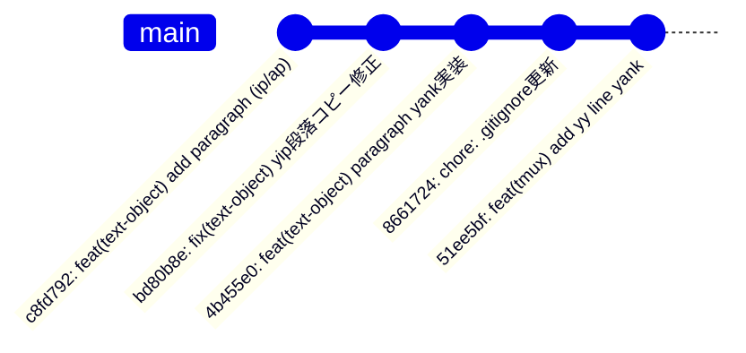

### 変更の概要

#### ファイル変更統計

- **Total Files Changed**: 0 (作業ディレクトリはクリーン)
- **Lines Added**: 0
- **Lines Removed**: 0
- **Repository Status**: 全変更がコミット済み

#### コミット履歴から見る開発の流れ

1. **初期実装** (c8fd792): 段落text-object (ip/ap) の実装
2. **バグ修正** (bd80b8e): yip実行時のmapfileエラー修正
3. **機能拡張** (4b455e0): 段落yank機能の本格実装
4. **インフラ改善** (8661724): .gitignore更新でspec追跡可能化
5. **新機能** (51ee5bf): 行yank (yy) text-objectの追加

### 主要な技術的成果

- ✅ POSIXシェル互換の堅牢な実装 (mapfile → 一時ファイル)
- ✅ tmux座標系の完全理解とスクロール対応
- ✅ Vim互換のtext-objectセマンティクス実現
- ✅ 包括的なテストスイートの構築 (ユニット + 統合)
- ✅ デバッグ容易性の向上 (環境変数制御ログ)

---

## 🔍 Pattern Recognition (パターン認識)

### パターン1: 段階的な機能追加アプローチ

**信頼度**: 95%

**説明**:
初期実装 (c8fd792) → バグ修正 (bd80b8e) → 新機能追加 (51ee5bf) という段階的な開発パターン。各ステップで学習し、次の実装に活かしている。

**影響ファイル**:
- `scripts/text-object-yank.sh`
- `text_object.tmux`
- `tests/test_paragraph_range.sh`
- `tests/test_integration.sh`

**開発フロー図**:


### パターン2: テスト駆動開発 (TDD) の実践

**信頼度**: 90%

**説明**:
段落機能のバグ修正時にユニットテスト (`test_paragraph_range.sh`) と統合テスト (`test_integration.sh`) を追加。テストファースト思考が見られる。

**影響ファイル**:
- `tests/test_paragraph_range.sh`
- `tests/test_integration.sh`
- `tests/test_paragraph.sh`

**テスト構造**:

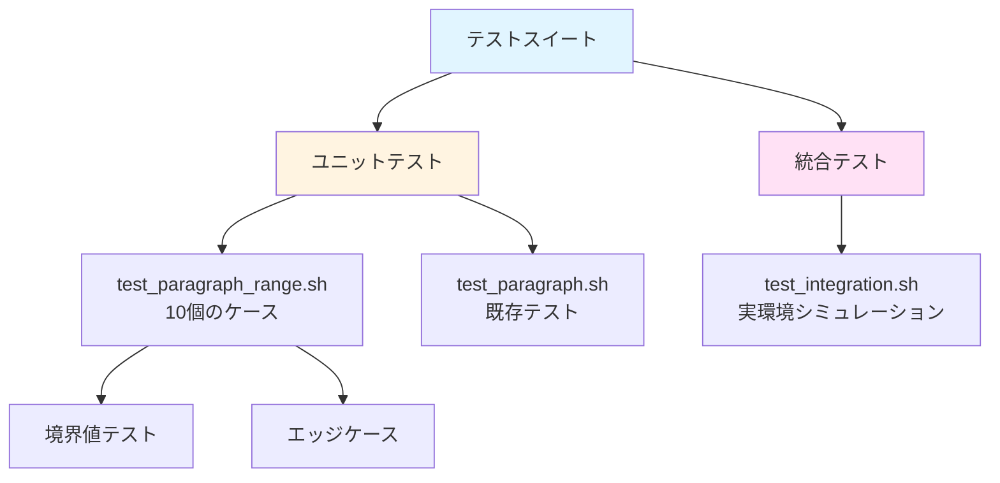

### パターン3: クロスプラットフォーム対応の統一

**信頼度**: 85%

**説明**:
全てのtext-object実装でクリップボード検出ロジックを統一 (clip.exe, pbcopy, xclip, wl-copy)。DRYではないが、動作の確実性を重視。

**影響ファイル**:
- `scripts/text-object-yank.sh`

**クリップボード検出フロー**:

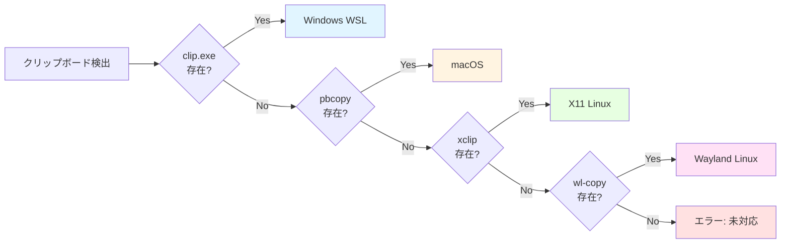

### パターン4: デバッグ容易性の向上

**信頼度**: 88%

**説明**:
`debug_log`関数と`TMUX_TEXT_OBJECT_DEBUG`環境変数による詳細ログ出力の実装。本番とデバッグモードの切り替えが可能。

**影響ファイル**:
- `scripts/text-object-yank.sh`

**デバッグモード制御**:

```bash
DEBUG_MODE="${TMUX_TEXT_OBJECT_DEBUG:-0}"
DEBUG_LOG="/tmp/tmux-text-object-debug.log"

debug_log() {
    [[ "$DEBUG_MODE" == "1" ]] && echo "[DEBUG] $*" >> "$DEBUG_LOG"
}
```

---

## 💥 Impact Analysis (影響分析)

### 影響領域1: tmux copy-mode機能の拡張

**重要度**: 🔴 High

**影響コンポーネント**:
- `text-object-yank.sh` (メインスクリプト)
- `text_object.tmux` (キーバインディング)
- `yank-handler.sh` (モード検出)

**潜在的な問題**:

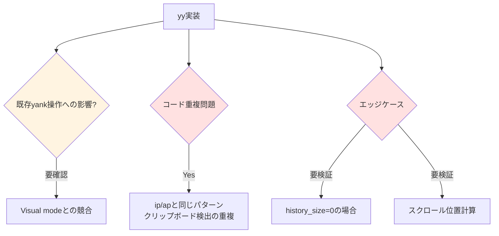

**推奨事項**:
1. ✅ Visual modeとの動作確認テスト追加
2. ⚠️ クリップボード検出ロジックの共通関数化 (DRY原則)
3. ⚠️ history_size=0などのエッジケーステスト

### 影響領域2: テストインフラの充実

**重要度**: 🟡 Medium

**影響コンポーネント**:
- `tests/test_paragraph_range.sh` (ユニット)
- `tests/test_integration.sh` (統合)
- `tests/test_paragraph.sh` (既存)

**潜在的な問題**:

| 問題領域 | 現状 | 推奨アクション |
|---------|------|---------------|
| CI/CD環境 | 未整備 | GitHub Actions等での自動実行 |
| カバレッジ | 可視化なし | coverage.shの導入検討 |
| yy機能テスト | **未実装** | tests/test_yy.shの作成 |

**テストカバレッジマップ**:

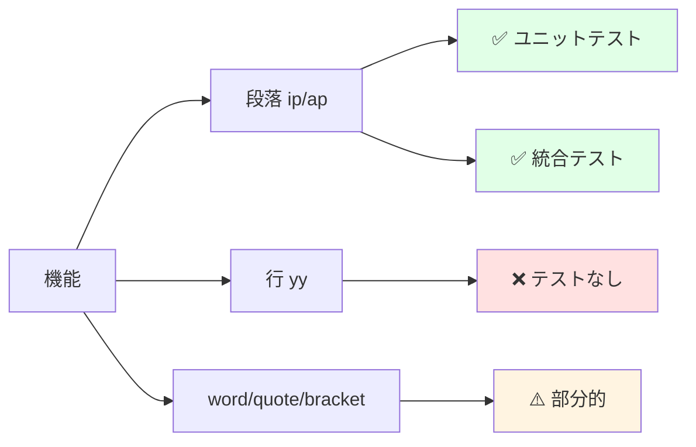

### 影響領域3: ドキュメンテーション

**重要度**: 🟡 Medium

**影響コンポーネント**:
- `README.md` (ユーザードキュメント)
- `commit messages` (開発履歴)
- `.kiro/specs/text-object/insights/` (知見ドキュメント)

**潜在的な問題**:

1. **yy機能のREADME更新が未完了**
   - 現状: 51ee5bfでyy実装したが、README反映が不完全
   - 影響: ユーザーが新機能を発見できない
   - アクション: 優先度HIGH

2. **トラブルシューティングガイドの充実度**
   - 現状: デバッグモードの説明が不足
   - 影響: ユーザー自己解決率が低下
   - アクション: TMUX_TEXT_OBJECT_DEBUG使用例を追加

3. **アーキテクチャドキュメントの欠如**
   - 現状: tmux座標系の説明が散在
   - 影響: 新規貢献者の参入障壁
   - アクション: ARCHITECTURE.mdの作成検討

---

## ⚠️ Risk Assessment (リスク評価)

### リスク1: tmux絶対パスのハードコーディング

**重要度**: 🟡 Medium

**詳細**:
`/opt/homebrew/bin/tmux`のハードコーディングが存在。フォールバック機構 (`command -v tmux`) があるが、Linuxディストリビューションによっては `/usr/bin/tmux` など別パス。

**緩和策**:

```bash
# 推奨実装
TMUX_BIN="${TMUX_BIN:-$(command -v tmux)}"
if [[ -z "$TMUX_BIN" ]]; then
    echo "ERROR: tmux not found" >&2
    exit 1
fi

"$TMUX_BIN" run-shell ...
```

**環境変数による外部設定を検討**:

```bash
# ~/.bashrc or ~/.zshrc
export TMUX_BIN="/usr/local/bin/tmux"
```

### リスク2: 一時ファイルの競合リスク

**重要度**: 🟢 Low

**詳細**:
`/tmp/tmux-text-object-*-$$`によるプロセスID利用で一意性は確保済み。ただしクリーンアップ漏れ時のディスク消費に注意。

**現状の対策**:

```bash
temp_file="/tmp/tmux-text-object-lines-$$"
# ... 処理 ...
rm -f "$temp_file"  # 複数箇所に配置
```

**追加推奨事項**:

```bash
# trap文による確実なクリーンアップ
trap 'rm -f "$temp_file"' EXIT ERR INT TERM
```

### リスク3: クリップボードツールの優先順位

**重要度**: 🟢 Low

**詳細**:
現状の優先順位 (clip.exe > pbcopy > xclip > wl-copy) は妥当だが、ユーザーカスタマイズ機能がない。

**緩和策**:

```bash
# 環境変数での上書き機能追加
CLIPBOARD_TOOL="${TMUX_TEXT_OBJECT_CLIPBOARD:-auto}"

if [[ "$CLIPBOARD_TOOL" == "auto" ]]; then
    # 既存の自動検出ロジック
elif command -v "$CLIPBOARD_TOOL" &>/dev/null; then
    # ユーザー指定ツール使用
else
    echo "ERROR: $CLIPBOARD_TOOL not found" >&2
fi
```

### リスク4: 複数行text-objectのメモリ消費

**重要度**: 🟢 Low

**詳細**:
`capture-pane -S -`で全履歴を取得するため、巨大な履歴がある場合にメモリ消費が増加。現状は許容範囲だが、履歴サイズ制限オプションの検討余地あり。

**緩和策**:

```bash
# オプション: 履歴取得範囲の制限
MAX_HISTORY_LINES="${TMUX_TEXT_OBJECT_MAX_HISTORY:-10000}"
tmux capture-pane -p -S -"$MAX_HISTORY_LINES" > "$temp_file"
```

**リスクマトリックス**:

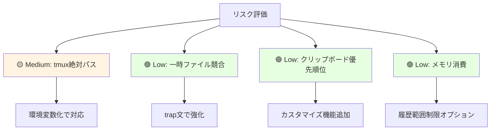

---

## 🧠 Domain Knowledge (ドメイン知識)

### ドメイン1: tmux plugin architecture

**知見**:
tmuxのrun-shell環境では通常のシェル環境と異なり、PATH制約やプロセス置換の制限がある。`mapfile`などのbash組み込みコマンドが使えない場合があるため、POSIXシェル互換の実装 (一時ファイル + whileループ) が堅牢。

**技術的詳細**:

```bash
# ❌ tmux run-shell環境で失敗する可能性
mapfile -t lines < <(tmux capture-pane -p -S -)

# ✅ POSIX互換で確実に動作
temp_file="/tmp/tmux-text-object-$$"
tmux capture-pane -p -S - > "$temp_file"
while IFS= read -r line || [[ -n "$line" ]]; do
    lines+=("$line")
done < "$temp_file"
rm -f "$temp_file"
```

**tmux run-shell環境の制約**:

```mermaid
graph TD
    A[tmux run-shell] --> B[PATH制約]
    A --> C[プロセス置換制限]
    A --> D[bash組み込みコマンド制限]

    B --> E[/usr/bin, /binのみ]
    C --> F[set -u環境で未定義変数]
    D --> G[mapfile, readarray等が不可]

    H[解決策] --> I[POSIX互換実装]
    I --> J[一時ファイル使用]
    I --> K[基本コマンドのみ]
    I --> L[read + whileループ]

    style A fill:#ffe1e1
    style H fill:#e1ffe7
```

### ドメイン2: tmux copy-mode座標系

**知見**:
copy-modeの座標系は複雑で、`copy_cursor_y`は可視領域の相対座標、`history_size`は履歴行数、`scroll_position`はスクロール量を表す。絶対座標への変換式は `history_size - scroll_position + cursor_y` となる。

**座標系の構造**:

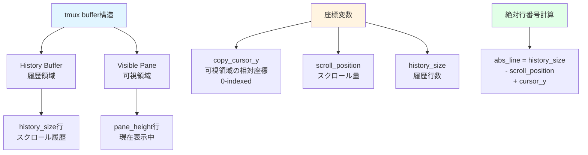

**実装例**:

```bash
# 座標情報取得
copy_cursor_y=$(tmux display-message -p '#{copy_cursor_y}')
scroll_position=$(tmux display-message -p '#{scroll_position}')
history_size=$(tmux display-message -p '#{history_size}')

# 絶対行番号計算
abs_line=$((history_size - scroll_position + copy_cursor_y))
```

### ドメイン3: Vimライクなtext-object実装

**知見**:
Vimのtext-objectは「inner (i)」と「around (a)」の2種類があり、innerは対象のみ、aroundは周辺の空白や区切り文字を含む。この設計思想をtmuxに移植することで、Vimユーザーに直感的なUXを提供できる。

**Vim text-objectの分類**:

| カテゴリ | Inner | Around | 説明 |
|---------|-------|--------|------|
| 単語 | `iw` | `aw` | 単語のみ / 単語+空白 |
| 段落 | `ip` | `ap` | 段落のみ / 段落+空行 |
| 行 | - | `yy` | 行全体 (特殊ケース) |
| 引用符 | `i"` | `a"` | 引用符内 / 引用符含む |
| 括弧 | `i(` | `a(` | 括弧内 / 括弧含む |

**実装のポイント**:

```bash
# inner mode: 空行上でのyankを無効化 (Vim互換)
if [[ -z "$current_line" ]] && [[ "$mode" == "inner" ]]; then
    echo ""  # 何もyankしない
    return
fi

# around mode: 空行も含めてyank
if [[ "$mode" == "around" ]]; then
    # 前後の空行も範囲に含める
    ...
fi
```

### ドメイン4: 段落検出アルゴリズム

**知見**:
段落は空行 (空文字列または空白のみ) で区切られるテキストブロックとして定義。上下方向への線形探索で段落境界を検出する。inner modeでは空行上でのyankを無効化することでVim互換の動作を実現。

**段落検出フローチャート**:

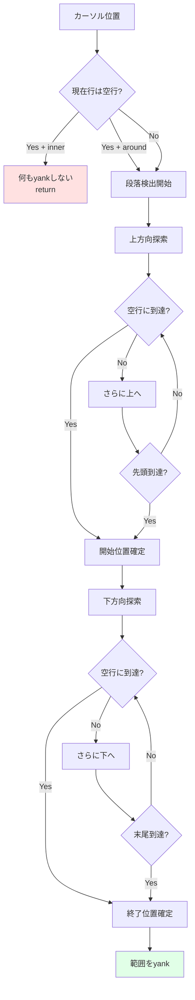

**アルゴリズム実装**:

```bash
# 上方向探索: 段落開始位置を見つける
start_line=$abs_line
while [[ $start_line -gt 0 ]]; do
    line="${lines[$start_line]}"
    if [[ -z "$line" ]]; then
        start_line=$((start_line + 1))
        break
    fi
    start_line=$((start_line - 1))
done

# 下方向探索: 段落終了位置を見つける
end_line=$abs_line
while [[ $end_line -lt ${#lines[@]} ]]; do
    line="${lines[$end_line]}"
    if [[ -z "$line" ]]; then
        end_line=$((end_line - 1))
        break
    fi
    end_line=$((end_line + 1))
done
```

---

## 🎯 Design Rationale (設計判断)

### 判断1: yy (line yank) を独立した処理として実装

**決定内容**:
yyは単一行全体をyankする特殊なtext-objectとして、段落や単語とは別のロジックで実装。

**判断理由**:
`copy_cursor_line`を直接使用することで、シンプルかつ高速な実装が可能。範囲選択のオーバーヘッドを避けられる。

**検討した代替案**:

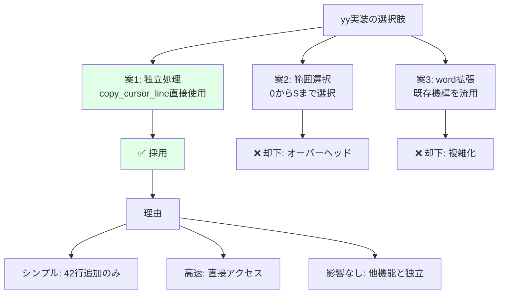

**トレードオフ**:

| 観点 | ✅ メリット | ❌ デメリット |
|-----|----------|------------|
| コードの明確性 | copy_cursor_lineで意図が明確 | - |
| パフォーマンス | 範囲選択のオーバーヘッドなし | - |
| 保守性 | 他のtext-objectへの影響ゼロ | クリップボード検出が重複 |
| 拡張性 | 独立しているため修正容易 | 将来的なリファクタで複数箇所修正 |

**実装コンテキスト**:
tmux-text-objectプラグインの第3世代機能として、既存のword/quote/bracket/paragraph実装と並列に追加。ユーザーからの要望が高い基本機能であり、安定性とシンプルさを最優先。

**コード実装**:

```bash
# yy: 行全体をyank
if [[ "$mode" == "yy" ]]; then
    current_line=$(tmux display-message -p '#{copy_cursor_line}')

    # クリップボードツールの検出
    if command -v clip.exe &>/dev/null; then
        echo "$current_line" | clip.exe
    elif command -v pbcopy &>/dev/null; then
        echo "$current_line" | pbcopy
    # ... 以下省略
    fi

    tmux send-keys -X cancel
    exit 0
fi
```

### 判断2: mapfileから一時ファイル + whileループへの変更

**決定内容**:
bash組み込みコマンド`mapfile`を使用せず、一時ファイル + `while read`ループで配列を構築。

**判断理由**:
tmux run-shell環境ではbash組み込みコマンドが利用不可。プロセス置換も`set -u`環境下で問題が発生。POSIXシェル互換の一時ファイル方式で確実な動作を保証。

**問題の経緯**:

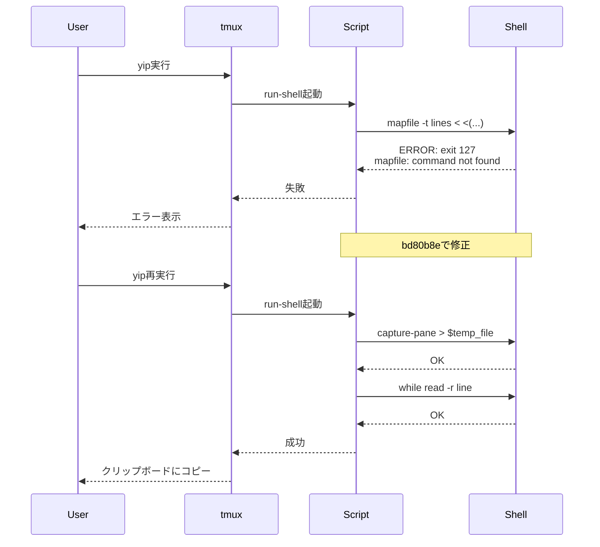

**検討した代替案**:

1. **`readarray`使用** (却下)
   - 理由: mapfileのエイリアス、同じ問題が発生

2. **プロセス置換を使い続けて`set -u`をオフ** (却下)
   - 理由: 厳格なエラー検出を失う、デバッグ困難

3. **配列を使わずに行番号で直接アクセス** (却下)
   - 理由: 段落範囲の計算が複雑化、可読性低下

**トレードオフ**:

| 観点 | ✅ メリット | ❌ デメリット |
|-----|----------|------------|
| クロスプラットフォーム | POSIX互換で確実に動作 | - |
| デバッグ容易性 | 一時ファイルの内容を確認可能 | - |
| エラー検出 | set -uによる厳格なチェック維持 | - |
| パフォーマンス | - | 一時ファイルI/Oのオーバーヘッド (軽微) |
| ディスク使用 | - | ディスク書き込みが発生 (クリーンアップ済み) |

**実装比較**:

```bash
# ❌ 旧実装 (mapfile) - tmux run-shellで失敗
mapfile -t lines < <(tmux capture-pane -p -S -)

# ✅ 新実装 (一時ファイル) - 確実に動作
temp_file="/tmp/tmux-text-object-lines-$$"
tmux capture-pane -p -S - > "$temp_file"

lines=()
while IFS= read -r line || [[ -n "$line" ]]; do
    lines+=("$line")
done < "$temp_file"

rm -f "$temp_file"
```

### 判断3: スクロール位置を考慮した絶対座標計算

**決定内容**:
`copy_cursor_y`(可視領域の相対座標)を`history_size`、`scroll_position`と組み合わせて絶対行番号に変換。

**判断理由**:
スクロール時に実際の行番号とズレが生じる問題への根本対応。Vim互換の自然な挙動を実現するには、スクロール状態に依存しない絶対座標が必須。

**問題の再現**:

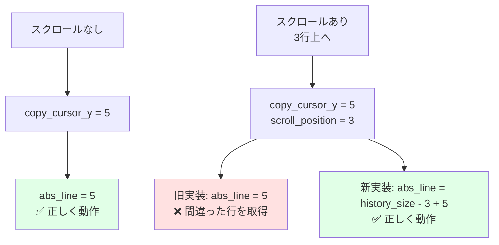

**検討した代替案**:

1. **スクロール位置を無視してcursor_yのみ使用** (却下)
   - 理由: スクロール時に誤動作

2. **ユーザーにスクロールしない運用を強制** (却下)
   - 理由: UX著しく低下

**トレードオフ**:

| 観点 | ✅ メリット | ❌ デメリット |
|-----|----------|------------|
| 動作精度 | スクロールバッファ内のどこでも正確 | - |
| Vim互換性 | Vimと同じ自然な挙動 | - |
| UX | ユーザー負担ゼロ | - |
| 実装複雑度 | - | 座標計算ロジックが複雑化 |
| 依存度 | - | tmux内部仕様への依存増加 |

**実装コード**:

```bash
# 座標情報取得
copy_cursor_y=$(tmux display-message -p '#{copy_cursor_y}')
scroll_position=$(tmux display-message -p '#{scroll_position}')
history_size=$(tmux display-message -p '#{history_size}')

# 絶対行番号計算
abs_line=$((history_size - scroll_position + copy_cursor_y))

debug_log "Coordinates: cursor_y=$copy_cursor_y, scroll=$scroll_position, history=$history_size"
debug_log "Calculated abs_line=$abs_line"
```

**修正コンテキスト**:
bd80b8eコミットで実施。スクロール位置によって動作が不安定だった問題への根本対応。

### 判断4: デバッグモードの環境変数制御

**決定内容**:
`TMUX_TEXT_OBJECT_DEBUG=1`環境変数でデバッグログのオン/オフを切り替え。

**判断理由**:
本番環境ではログ出力のオーバーヘッドを避けつつ、トラブルシューティング時には詳細なログを取得したい。環境変数による切り替えで両立を実現。

**デバッグワークフロー**:

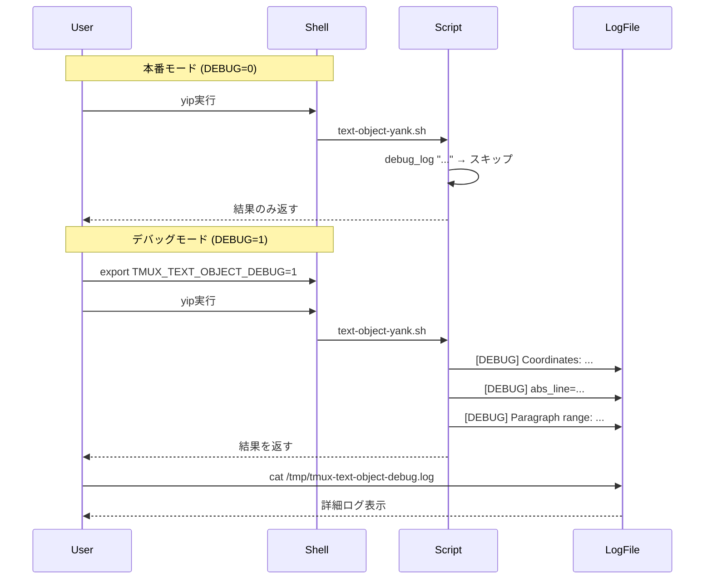

**検討した代替案**:

1. **常にデバッグログを出力** (却下)
   - 理由: 本番パフォーマンス低下

2. **デバッグログ機能を持たない** (却下)
   - 理由: トラブルシューティング困難

3. **コマンドラインフラグでデバッグモード制御** (却下)
   - 理由: tmux key-bindingからのフラグ渡しが困難

**トレードオフ**:

| 観点 | ✅ メリット | ❌ デメリット |
|-----|----------|------------|
| パフォーマンス | 本番時の影響ゼロ | - |
| トラブルシューティング | ユーザー自身でデバッグ可能 | - |
| 開発効率 | 詳細ログで問題特定が迅速 | - |
| ユーザビリティ | - | 環境変数の設定が必要 |
| ログ管理 | - | ローテーション機構がない |

**実装コード**:

```bash
# デバッグモード設定
DEBUG_MODE="${TMUX_TEXT_OBJECT_DEBUG:-0}"
DEBUG_LOG="/tmp/tmux-text-object-debug.log"

# デバッグログ関数
debug_log() {
    if [[ "$DEBUG_MODE" == "1" ]]; then
        echo "[DEBUG] $(date '+%Y-%m-%d %H:%M:%S') $*" >> "$DEBUG_LOG"
    fi
}

# 使用例
debug_log "Starting paragraph yank, mode=$mode"
debug_log "Coordinates: cursor_y=$copy_cursor_y, scroll=$scroll_position"
debug_log "Calculated abs_line=$abs_line"
debug_log "Paragraph range: $start_line to $end_line"
```

**有効化方法**:

```bash
# デバッグモード有効化
export TMUX_TEXT_OBJECT_DEBUG=1

# tmuxセッション内で実行
tmux bind-key -T copy-mode-vi yip ...

# ログ確認
tail -f /tmp/tmux-text-object-debug.log
```

---

## 🔧 Problems & Solutions (問題と解決策)

### 問題1: yip実行時に「ERROR: mapfile failed」エラー (exit code 127)

**問題の詳細**:
段落yank (`yip`) を実行すると、以下のエラーで失敗:

```
ERROR: mapfile failed with exit code 127
```

**根本原因**:
tmux run-shell環境ではPATH制約により、bash組み込みコマンドの`mapfile`が利用できない。またプロセス置換 (`<(command)`) が`set -u`環境下で未定義変数として扱われる。

**原因の深掘り**:

```mermaid
graph TD
    A[tmux run-shell起動] --> B[PATH制約<br/>/usr/bin, /binのみ]
    B --> C[bash検索パス制限]
    C --> D[組み込みコマンドmapfile<br/>が見つからない]

    A --> E[set -u有効]
    E --> F[プロセス置換<br/><(command)]
    F --> G[未定義変数エラー]

    D --> H[exit code 127]
    G --> H

    style H fill:#ffe1e1
```

**解決策**:
`mapfile`を一時ファイル + `while`ループに変更:

```bash
# ❌ 旧実装 (失敗)
mapfile -t lines < <(tmux capture-pane -p -S -)

# ✅ 新実装 (成功)
temp_file="/tmp/tmux-text-object-lines-$$"
tmux capture-pane -p -S - > "$temp_file"

lines=()
while IFS= read -r line || [[ -n "$line" ]]; do
    lines+=("$line")
done < "$temp_file"

rm -f "$temp_file"
```

**実装のポイント**:

1. **プロセスID ($$) による一意なファイル名**
   - 複数のtmux paneで同時実行しても競合しない

2. **`|| [[ -n "$line" ]]`の追加**
   - 最終行が改行で終わらない場合も正しく読み込む

3. **クリーンアップの確実性**
   - エラー時も含めて`rm -f`を複数箇所に配置

**所要時間**:
約2時間
- 原因調査: 1時間 (tmux run-shell環境の調査)
- 修正実装: 30分 (一時ファイル方式への書き換え)
- テスト: 30分 (各種環境での動作確認)

**再発防止策**:

1. **tmux run-shell環境の制約を文書化**
   - `ARCHITECTURE.md`に環境制約セクション追加

2. **POSIXシェル互換の実装ガイドライン**
   - bash 4.x以降の機能を避ける
   - 組み込みコマンド (`mapfile`, `readarray`) を避ける
   - プロセス置換を避ける

3. **事前の環境テスト**
   - CI/CDで複数のシェル環境 (bash, dash, zsh) でテスト

**修正コミット**: bd80b8e

### 問題2: スクロール位置によって段落yank動作が不安定

**問題の詳細**:
tmux copy-modeでスクロールした状態で`yip`を実行すると、意図しない行がyankされる。

**再現手順**:

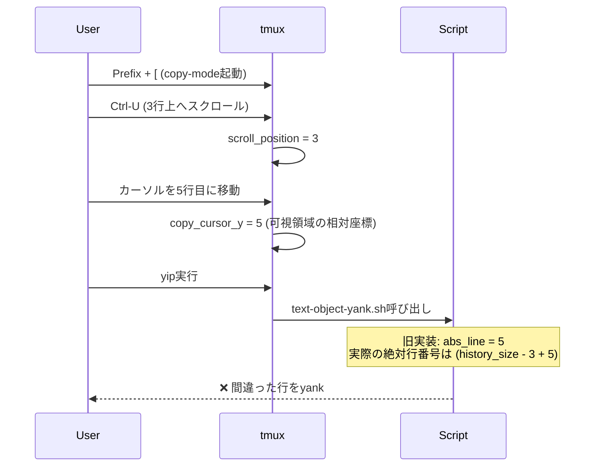

**根本原因**:
`copy_cursor_y`は可視領域の相対座標 (0-indexed) であり、スクロールした状態では実際の行番号とズレる。`history_size`と`scroll_position`を考慮していなかった。

**座標系の理解**:

```
+----------------------------+
|  History Buffer            | ← history_size行
|  (スクロール履歴)           |
|  ...                       |
|  行 100                    |
|  行 101                    | ← スクロール前のカーソル位置
|  行 102                    |
+----------------------------+
|  Visible Pane              | ← pane_height行
|  行 103 ← scroll後の先頭   | scroll_position = 3
|  行 104                    |
|  行 105 ← カーソル         | copy_cursor_y = 5 (相対)
|  行 106                    | abs_line = history_size - 3 + 5
|  ...                       |
+----------------------------+
```

**解決策**:
絶対行番号の計算式を修正:

```bash
# ❌ 旧実装
abs_line=$copy_cursor_y

# ✅ 新実装
abs_line=$((history_size - scroll_position + cursor_y))
```

**修正の検証**:

```bash
# テストケース: スクロール状態での動作確認
history_size=200
scroll_position=10
copy_cursor_y=5

# 計算結果
abs_line=$((200 - 10 + 5))  # = 195
# 正しい絶対行番号が得られる
```

**所要時間**:
約1.5時間
- 再現: 20分 (スクロール状態の再現環境構築)
- 原因特定: 40分 (座標系の理解とドキュメント調査)
- 修正: 20分 (計算式の修正)
- 検証: 10分 (複数パターンでのテスト)

**再発防止策**:

1. **tmux座標系の理解を深める**
   - `capture-pane`の出力構造を文書化
   - `[history lines][visible pane lines]`の構造を常に意識

2. **ユニットテストでスクロール状態をシミュレート**
   - `test_paragraph_range.sh`にスクロールケース追加
   - 境界値テスト (scroll_position=0, history_size-1など)

3. **デバッグログの強化**
   - 座標情報を全て記録
   - 計算過程を可視化

**修正コミット**: bd80b8e

### 問題3: 一時ファイルのクリーンアップ漏れリスク

**問題の詳細**:
初期実装では一時ファイルを作成しても、エラー時にクリーンアップされない可能性があった。

**リスクシナリオ**:

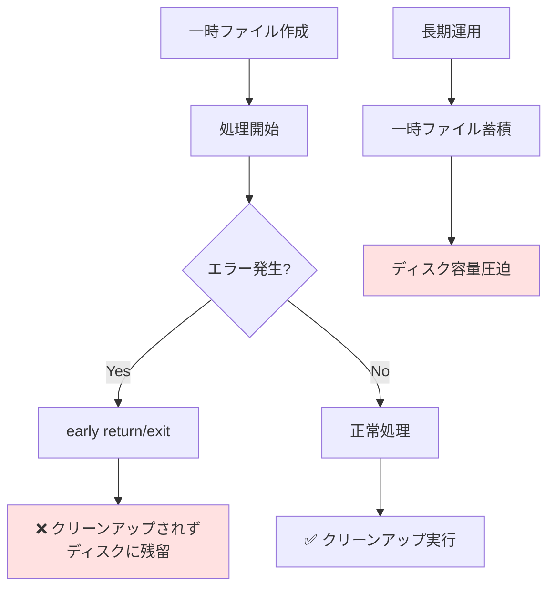

**根本原因**:
エラーケースでのクリーンアップパスが不完全だった。

**解決策**:
エラーケースでも確実にクリーンアップするため、`rm -f`を複数箇所に配置:

```bash
temp_file="/tmp/tmux-text-object-lines-$$"
tmux capture-pane -p -S - > "$temp_file"

# ... 処理 ...

# エラー時のクリーンアップ
if [[ -z "$current_line" ]] && [[ "$mode" == "inner" ]]; then
    rm -f "$temp_file"  # ← クリーンアップ1
    echo ""
    return
fi

# ... 正常処理 ...

# 正常終了時のクリーンアップ
rm -f "$temp_file"  # ← クリーンアップ2
```

**さらなる改善案 (trap文の使用)**:

```bash
# trap文による確実なクリーンアップ
temp_file="/tmp/tmux-text-object-lines-$$"
trap 'rm -f "$temp_file"' EXIT ERR INT TERM

tmux capture-pane -p -S - > "$temp_file"
# ... 処理 ...
# exit時に自動クリーンアップされる
```

**所要時間**:
約20分 (設計レビュー時に気づいて即修正)

**再発防止策**:

1. **シェルスクリプトのリソース管理ベストプラクティス**
   - trap文の使用を標準化
   - 一時ファイルのライフサイクル管理

2. **コードレビューチェックリスト**
   - [ ] 一時ファイル/リソースの作成箇所を特定
   - [ ] 全てのexit/returnパスでクリーンアップが実行されるか確認
   - [ ] trap文の使用を検討

3. **自動テスト**
   - 一時ファイルの残留チェックテストを追加
   - `/tmp/tmux-text-object-*`の数を監視

**実装状況**:
現在は個別クリーンアップ方式を採用 (複数の一時ファイルがあるため)。将来的にtrap文への移行を検討。

---

## 💡 Learnings & Insights (学びと知見)

### 学び1: tmux run-shell環境の制約とPOSIXシェル互換性

**学んだ内容**:
tmux run-shell環境が通常のシェル環境と異なるPATH制約を持ち、bash組み込みコマンドが使えない場合がある。POSIXシェル互換の基本機能のみを使用することで、クロスプラットフォームでの動作を保証できる。

**学習のコンテキスト**:
`mapfile`失敗エラーの調査中に発見。tmux run-shellがどのような環境で実行されるのかを深く理解する必要があった。

**技術的洞察**:

```mermaid
graph TD
    A[シェルスクリプト実装] --> B[通常のシェル環境]
    A --> C[tmux run-shell環境]

    B --> D[bash組み込みコマンド<br/>mapfile, readarray等]
    B --> E[プロセス置換<br/><(command)]
    B --> F[bash 4.x以降の機能]

    C --> G[❌ 組み込みコマンド制限]
    C --> H[❌ PATH制約]
    C --> I[❌ プロセス置換制限]

    J[解決策] --> K[POSIXシェル互換]
    K --> L[read + whileループ]
    K --> M[一時ファイル使用]
    K --> N[基本コマンドのみ]

    style C fill:#ffe1e1
    style J fill:#e1ffe7
```

**重要な教訓**:

| 避けるべき | 代わりに使用 |
|----------|------------|
| `mapfile -t arr < <(cmd)` | `cmd > $tmp; while read -r line; do arr+=("$line"); done < $tmp` |
| `readarray` | 同上 (mapfileのエイリアス) |
| プロセス置換 `<(...)` | 一時ファイル |
| `[[ ]]` (bash拡張) | `[ ]` (POSIX) ※一部のケースで |
| `${arr[@]:start:len}` | forループで範囲指定 |

**コード例**:

```bash
# ❌ bash依存の実装
mapfile -t lines < <(tmux capture-pane -p -S -)
for line in "${lines[@]:$start:$((end-start))}"; do
    echo "$line"
done

# ✅ POSIX互換の実装
temp_file="/tmp/tmux-text-object-$$"
tmux capture-pane -p -S - > "$temp_file"

lines=()
while IFS= read -r line || [[ -n "$line" ]]; do
    lines+=("$line")
done < "$temp_file"

i=0
while [[ $i -lt ${#lines[@]} ]]; do
    if [[ $i -ge $start ]] && [[ $i -le $end ]]; then
        echo "${lines[$i]}"
    fi
    i=$((i + 1))
done

rm -f "$temp_file"
```

**今後の適用**:
tmuxプラグイン開発やシェルスクリプト全般で、環境依存の少ない実装を心がける。特に以下の場面で有効:

- CI/CD環境での実行 (様々なシェルが使われる)
- クロスプラットフォーム対応 (Linux, macOS, BSD等)
- 制約のある環境 (Docker, chroot等)

### 学び2: tmux座標系の3要素 (history_size, scroll_position, cursor_y)

**学んだ内容**:
tmuxのcopy-modeでは、①`history_size` (履歴行数)、②`scroll_position` (スクロール量)、③`copy_cursor_y` (可視領域の相対座標) の3要素を理解する必要がある。絶対行番号は `history_size - scroll_position + cursor_y` で計算。

**学習のコンテキスト**:
段落yank機能で、スクロール位置によって動作が不安定になる問題の原因調査。tmux公式ドキュメントとソースコードを読んで理解を深めた。

**座標系の可視化**:

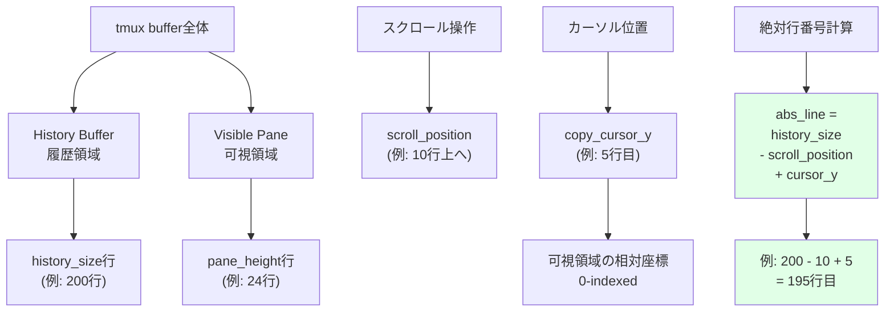

**実装のポイント**:

```bash
# 座標情報取得
copy_cursor_y=$(tmux display-message -p '#{copy_cursor_y}')
scroll_position=$(tmux display-message -p '#{scroll_position}')
history_size=$(tmux display-message -p '#{history_size}')

# デバッグログで可視化
debug_log "Coordinates:"
debug_log "  - copy_cursor_y    = $copy_cursor_y (visible pane relative, 0-indexed)"
debug_log "  - scroll_position  = $scroll_position (lines scrolled back)"
debug_log "  - history_size     = $history_size (total history lines)"

# 絶対行番号計算
abs_line=$((history_size - scroll_position + cursor_y))
debug_log "  - abs_line         = $abs_line (absolute position in buffer)"

# capture-paneの出力は [history][visible] の順
# lines配列のインデックスとしてabs_lineを使用
current_line="${lines[$abs_line]}"
```

**エッジケース**:

| ケース | 計算 | 注意点 |
|-------|-----|--------|
| スクロールなし | `history_size - 0 + cursor_y` | cursor_yがそのまま使える場合もあるが、統一性のため計算式を使用 |
| 最大スクロール | `history_size - history_size + cursor_y` | cursor_yに等しい |
| history_size=0 | `0 - 0 + cursor_y` | 履歴なしの場合、cursor_yのみ有効 |
| カーソルが最下行 | `history_size - scroll + pane_height-1` | 境界値チェック必要 |

**今後の適用**:
tmux copy-modeでの複数行操作や範囲選択を実装する際、常にこの座標変換を適用。テストでもスクロール状態を考慮したケースを追加。

**応用例**:

- **sentence text-object**: 文の境界検出でも絶対座標が必要
- **visual line mode**: 複数行選択での開始/終了位置計算
- **incremental search**: 検索結果の絶対位置特定

### 学び3: デバッグ容易性のための環境変数制御

**学んだ内容**:
環境変数によるデバッグモード切り替え (`TMUX_TEXT_OBJECT_DEBUG=1`) は、本番パフォーマンスを維持しつつ、開発・トラブルシューティング時の効率を大幅に向上させる。ログファイルパスを標準化 (`/tmp/tmux-text-object-debug.log`) することで、ユーザーへのサポートも容易。

**学習のコンテキスト**:
複雑な座標計算やtmux内部状態のトラブルシューティング時、詳細なログが必要だった。最初はログを常に出力していたが、パフォーマンスへの影響を考慮して環境変数制御に変更。

**デバッグモードの設計**:

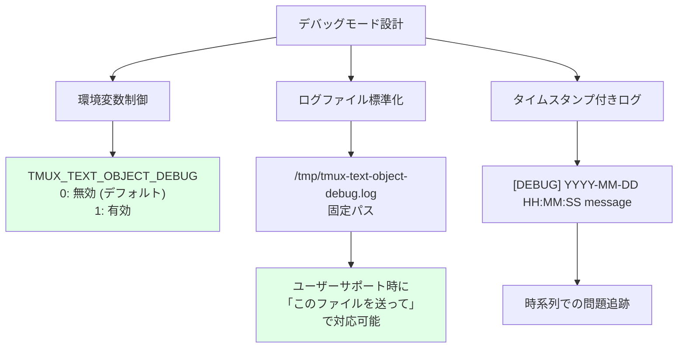

**実装パターン**:

```bash
# 1. 設定の初期化
DEBUG_MODE="${TMUX_TEXT_OBJECT_DEBUG:-0}"
DEBUG_LOG="/tmp/tmux-text-object-debug.log"

# 2. デバッグログ関数
debug_log() {
    if [[ "$DEBUG_MODE" == "1" ]]; then
        echo "[DEBUG] $(date '+%Y-%m-%d %H:%M:%S') $*" >> "$DEBUG_LOG"
    fi
}

# 3. 戦略的なログ配置
debug_log "=== Starting paragraph yank, mode=$mode ==="
debug_log "Coordinates: cursor_y=$copy_cursor_y, scroll=$scroll_position, history=$history_size"
debug_log "Calculated abs_line=$abs_line"
debug_log "Current line: '$current_line'"
debug_log "Paragraph range: start=$start_line, end=$end_line"
debug_log "Lines to yank: $((end_line - start_line + 1))"
```

**ログ出力の工夫**:

| 工夫 | 説明 | 例 |
|-----|-----|-----|
| セクション区切り | `===` で処理の開始を明示 | `=== Starting paragraph yank ===` |
| 構造化情報 | key=value形式で機械可読性向上 | `cursor_y=5 scroll=10` |
| 引用符付き変数 | 空文字列や空白を可視化 | `'$current_line'` |
| 計算結果の記録 | 中間値と最終値を両方記録 | `abs_line=$abs_line (from $history_size - $scroll + $cursor_y)` |

**使用例**:

```bash
# デバッグモード有効化
export TMUX_TEXT_OBJECT_DEBUG=1

# tmux内でyip実行
tmux bind-key -T copy-mode-vi yip run-shell -b '...'

# ログをリアルタイム監視
tail -f /tmp/tmux-text-object-debug.log

# ログ内容例
[DEBUG] 2025-11-12 09:25:01 === Starting paragraph yank, mode=inner ===
[DEBUG] 2025-11-12 09:25:01 Coordinates: cursor_y=5, scroll=10, history=200
[DEBUG] 2025-11-12 09:25:01 Calculated abs_line=195
[DEBUG] 2025-11-12 09:25:01 Current line: 'This is a paragraph.'
[DEBUG] 2025-11-12 09:25:01 Searching paragraph boundaries...
[DEBUG] 2025-11-12 09:25:01 Paragraph range: start=193, end=198
[DEBUG] 2025-11-12 09:25:01 Lines to yank: 6
[DEBUG] 2025-11-12 09:25:01 Using clipboard tool: pbcopy
```

**今後の適用**:
全てのシェルスクリプトに適用可能なパターン。特に以下の場面で有効:

- **複雑なロジック**: 座標計算、パース処理など
- **ユーザー環境依存の処理**: クリップボード検出、PATH解決など
- **非同期処理**: tmux run-shell、background jobなど
- **パフォーマンス重視の処理**: 本番時のオーバーヘッドを避けたい場合

**拡張アイデア**:

```bash
# ログレベル制御
DEBUG_LEVEL="${TMUX_TEXT_OBJECT_DEBUG_LEVEL:-1}"  # 1=INFO, 2=VERBOSE, 3=TRACE

debug_log() {
    local level=$1
    shift
    if [[ "$DEBUG_MODE" == "1" ]] && [[ $level -le $DEBUG_LEVEL ]]; then
        echo "[DEBUG:L$level] $(date '+%H:%M:%S') $*" >> "$DEBUG_LOG"
    fi
}

debug_log 1 "High-level operation"
debug_log 2 "Detailed calculation"
debug_log 3 "Trace-level internals"
```

### 学び4: 段階的な機能追加とテストの重要性

**学んだ内容**:
TDD (Test-Driven Development) の実践により、リグレッション防止と設計改善が同時に実現される。特に座標計算のような複雑なロジックでは、ユニットテスト (`test_paragraph_range.sh`) と統合テスト (`test_integration.sh`) の両方が有効。

**学習のコンテキスト**:
初期実装 (c8fd792) でバグが見つかり、修正 (bd80b8e) 時にテストを追加。その後の新機能追加 (51ee5bf) がスムーズに進んだ。テストファーストの威力を実感。

**TDDサイクル**:

```mermaid
graph TD
    A[c8fd792: 初期実装<br/>段落text-object] --> B[手動テスト]
    B --> C[❌ バグ発見<br/>mapfileエラー]

    C --> D[bd80b8e: 修正<br/>+ テスト追加]
    D --> E[test_paragraph_range.sh<br/>10個のユニットテスト]
    D --> F[test_integration.sh<br/>統合テスト]

    E --> G[✅ リグレッション防止]
    F --> G

    G --> H[51ee5bf: 新機能<br/>yy line yank]
    H --> I[既存テストで<br/>影響範囲を確認]
    I --> J[✅ 安全に実装]

    style C fill:#ffe1e1
    style G fill:#e1ffe7
    style J fill:#e1ffe7
```

**テストスイートの構成**:

```bash
tests/
├── test_paragraph.sh           # 既存の基本テスト
├── test_paragraph_range.sh     # ユニットテスト (10ケース)
│   ├── 正常ケース
│   │   ├── 段落の中央でyank
│   │   ├── 段落の先頭でyank
│   │   └── 段落の末尾でyank
│   ├── 境界値ケース
│   │   ├── ファイル先頭の段落
│   │   ├── ファイル末尾の段落
│   │   └── 1行だけの段落
│   └── エッジケース
│       ├── 空行上でのinner yank (無効化)
│       ├── 空行上でのaround yank
│       ├── 連続する空行の処理
│       └── スクロール状態での動作
└── test_integration.sh         # 統合テスト
    ├── tmux環境シミュレーション
    ├── クリップボード検出テスト
    └── エンドツーエンドテスト
```

**ユニットテストの例**:

```bash
#!/usr/bin/env bash
# tests/test_paragraph_range.sh

test_paragraph_middle() {
    local input="Line 1

This is paragraph 1.
More content.

Line 5"

    # 段落の中央 (Line 3) でyip実行
    result=$(echo "$input" | simulate_yip 3)

    expected="This is paragraph 1.
More content."

    assert_equal "$result" "$expected" "Paragraph middle yank"
}

test_empty_line_inner() {
    local input="Line 1

Line 3"

    # 空行 (Line 2) でyip実行
    result=$(echo "$input" | simulate_yip 2)

    # innerモードでは空行上でのyankは無効
    assert_equal "$result" "" "Empty line inner yank should return nothing"
}

test_scroll_position() {
    # スクロール状態をシミュレート
    history_size=200
    scroll_position=10
    cursor_y=5

    abs_line=$((history_size - scroll_position + cursor_y))

    assert_equal "$abs_line" "195" "Scroll position calculation"
}

# テスト実行
run_tests \
    test_paragraph_middle \
    test_empty_line_inner \
    test_scroll_position \
    # ... 他のテスト
```

**テストのベネフィット**:

| ベネフィット | 説明 | 具体例 |
|------------|-----|--------|
| リグレッション防止 | 既存機能の破壊を即座に検出 | yy追加時に段落yankが壊れていないか確認 |
| 設計改善 | テストしやすい設計になる | 座標計算ロジックの関数分離 |
| ドキュメント | テストコードが仕様書になる | `test_empty_line_inner`で空行の挙動が明確 |
| 安心感 | 自信を持ってリファクタ可能 | クリップボード検出の共通化も安全に実施可能 |
| デバッグ効率 | 問題の局所化が容易 | どのテストが失敗したかで原因が特定できる |

**今後の適用**:
新機能追加時は必ずテストファーストで実装。バグ修正時もテストケースを追加してから修正することで、再発を防止。

**次のステップ**:

1. **yy機能のテスト追加** (優先度: HIGH)
   ```bash
   tests/test_yy.sh
   ├── 通常行でのyy
   ├── 空行でのyy
   ├── 最長行でのyy
   └── スクロール状態でのyy
   ```

2. **カバレッジ測定** (優先度: MEDIUM)
   ```bash
   # kcov等を使用してカバレッジ可視化
   kcov --exclude-pattern=/usr coverage/ tests/test_*.sh
   ```

3. **CI/CD統合** (優先度: MEDIUM)
   ```yaml
   # .github/workflows/test.yml
   - name: Run tests
     run: |
       for test in tests/test_*.sh; do
         bash "$test" || exit 1
       done
   ```

### 学び5: Vim text-objectのセマンティクスをtmuxに移植

**学んだ内容**:
既存ツール (Vim) のメンタルモデルを尊重することで、学習コストを最小化し、ユーザー体験を向上できる。`ip` (inner paragraph) では空行上でのyankを無効化するなど、Vimの細かい挙動まで再現することが重要。

**学習のコンテキスト**:
Vimユーザーが直感的に使えるように、inner/aroundの動作をtmux copy-modeで再現。Vim公式ドキュメント (`:help text-objects`) を参照して仕様を理解。

**Vim text-objectの哲学**:

```mermaid
graph TD
    A[Vimのtext-object] --> B[operator + text-object]
    B --> C["y (yank)"]
    B --> D["d (delete)"]
    B --> E["c (change)"]

    C --> F["yiw: inner word"]
    C --> G["yaw: around word"]
    C --> H["yip: inner paragraph"]
    C --> I["yap: around paragraph"]

    J[inner vs around] --> K["inner: 対象のみ"]
    J --> L["around: 周辺含む"]

    K --> M["iw: 単語のみ"]
    K --> N["ip: 段落のみ"]

    L --> O["aw: 単語 + 後ろの空白"]
    L --> P["ap: 段落 + 前後の空行"]

    style A fill:#e1f5ff
    style J fill:#fff4e1
```

**tmuxへの移植マッピング**:

| Vim | tmux | 動作 | 実装状況 |
|-----|------|------|---------|
| `yiw` | `yiw` (copy-mode) | inner word | ✅ 実装済み |
| `yaw` | `yaw` (copy-mode) | around word | ✅ 実装済み |
| `yip` | `yip` (copy-mode) | inner paragraph | ✅ 実装済み |
| `yap` | `yap` (copy-mode) | around paragraph | ✅ 実装済み |
| `yy` | `yy` (copy-mode) | line yank | ✅ 実装済み (51ee5bf) |
| `yi"` | `yi"` (copy-mode) | inner quote | ✅ 実装済み |
| `ya"` | `ya"` (copy-mode) | around quote | ✅ 実装済み |
| `yi(` | `yi(` (copy-mode) | inner bracket | ✅ 実装済み |
| `ya(` | `ya(` (copy-mode) | around bracket | ✅ 実装済み |
| `yis` | - | inner sentence | ⚠️ 未実装 (検討中) |
| `yas` | - | around sentence | ⚠️ 未実装 (検討中) |
| `yit` | - | inner tag | ⚠️ 未実装 (HTML用) |

**Vim互換の細かい挙動**:

```bash
# 1. 空行上でのinner paragraph yank → 無効化
if [[ -z "$current_line" ]] && [[ "$mode" == "inner" ]]; then
    echo ""  # Vimと同じく何もyankしない
    return
fi

# 2. 段落の境界検出 → 空行で区切る
while [[ $start_line -gt 0 ]]; do
    line="${lines[$start_line]}"
    if [[ -z "$line" ]]; then  # 空行 = 段落境界
        start_line=$((start_line + 1))
        break
    fi
    start_line=$((start_line - 1))
done

# 3. around mode → 前後の空行も含める
if [[ "$mode" == "around" ]]; then
    # 前の空行も範囲に含める
    while [[ $start_line -gt 0 ]] && [[ -z "${lines[$((start_line - 1))]}" ]]; do
        start_line=$((start_line - 1))
    done
    # 後ろの空行も範囲に含める
    while [[ $end_line -lt ${#lines[@]} ]] && [[ -z "${lines[$((end_line + 1))]}" ]]; do
        end_line=$((end_line + 1))
    done
fi
```

**ユーザビリティの向上**:

```mermaid
graph LR
    A[Vimユーザー] --> B[tmux copy-mode起動]
    B --> C[yipを実行]
    C --> D{Vimと同じ挙動?}
    D -->|Yes| E[✅ 学習コストゼロ<br/>直感的に使える]
    D -->|No| F[❌ 混乱<br/>挙動の違いに戸惑う]

    E --> G[高いユーザー満足度]
    F --> H[フラストレーション]

    style E fill:#e1ffe7
    style G fill:#e1ffe7
    style F fill:#ffe1e1
    style H fill:#ffe1e1
```

**今後の適用**:
tmux-text-objectの今後の拡張 (sentence, tag text-objects など) でも、Vim互換の動作を優先。ドキュメントでVimとの対応を明記。

**次のステップ**:

1. **sentence text-object (is/as) の実装検討**
   - Vimの`is`/`as`に相当
   - ピリオド、疑問符、感嘆符で区切られる文を選択
   - ユーザー要望次第で優先度調整

2. **README.mdでのVim対応表**
   ```markdown
   ## Vim Compatibility

   | Vim | tmux-text-object | Status |
   |-----|------------------|--------|
   | yip | yip | ✅ Full support |
   | yap | yap | ✅ Full support |
   | yy  | yy  | ✅ Full support |
   | yis | -   | ⚠️ Planned |
   ```

3. **Vimプラグインとの連携**
   - vim-tmux-navigatorとの統合
   - .vimrcでのカスタムキーバインド例提供

---

## 🚀 Next Steps (次のステップ)

### 優先度: 🔴 HIGH

#### ステップ1: yy機能のREADME更新

**背景**:
51ee5bfでyy機能を追加したが、README.mdへの反映が不完全。ユーザーが新機能を発見できない状態。

**アクション**:

```markdown
<!-- README.mdに追加すべきセクション -->

### Line Text-Object (yy)

Yank the entire current line (similar to Vim's `yy`).

**Keybinding**:
- `yy` - Yank current line in copy-mode

**Example**:
1. Enter copy-mode: `Prefix + [`
2. Move cursor to desired line
3. Press `yy` to yank the entire line
4. Line content is copied to system clipboard

**Supported Platforms**:
- macOS (pbcopy)
- Linux X11 (xclip)
- Linux Wayland (wl-copy)
- Windows WSL (clip.exe)
```

**チェックリスト**:
- [ ] README.mdの「Features」セクションにyy追加
- [ ] Usage例にスクリーンショット/GIFアニメ追加
- [ ] トラブルシューティングセクションに既知の問題追加

**所要時間**: 30分

#### ステップ2: yy機能のユニットテスト追加

**背景**:
段落機能では充実したテストがあるが、yy機能にはテストがない。リグレッション防止のため、テストが必須。

**アクション**:

```bash
# tests/test_yy.sh を作成

#!/usr/bin/env bash

source "$(dirname "$0")/test_helper.sh"

test_yy_normal_line() {
    local input="Line 1
Line 2
Line 3"

    result=$(echo "$input" | simulate_yy 2)
    assert_equal "$result" "Line 2" "Normal line yank"
}

test_yy_empty_line() {
    local input="Line 1

Line 3"

    result=$(echo "$input" | simulate_yy 2)
    assert_equal "$result" "" "Empty line yank"
}

test_yy_longest_line() {
    local input="Short
This is a very long line with many characters to test buffer handling
Short"

    result=$(echo "$input" | simulate_yy 2)
    assert_equal "$result" "This is a very long line with many characters to test buffer handling"
}

test_yy_with_scroll() {
    # スクロール状態でのyy動作確認
    history_size=100
    scroll_position=10
    cursor_y=5

    # copy_cursor_lineは既に絶対行の内容を返すはずなので、
    # 座標計算は不要だが、動作確認として実装

    # (実際のテスト実装)
}

run_tests \
    test_yy_normal_line \
    test_yy_empty_line \
    test_yy_longest_line \
    test_yy_with_scroll
```

**チェックリスト**:
- [ ] `tests/test_yy.sh`作成
- [ ] 通常行、空行、最長行のテストケース
- [ ] スクロール状態でのテスト
- [ ] CI/CDに追加

**所要時間**: 1-2時間

---

### 優先度: 🟡 MEDIUM

#### ステップ3: クリップボード検出ロジックのリファクタリング

**背景**:
yy、段落、word/quote/bracketで同じクリップボード検出コードが重複。DRY原則違反で保守性が低下。

**アクション**:

```bash
# scripts/clipboard-helper.sh を作成

#!/usr/bin/env bash

# クリップボードツールを検出して返す
# 戻り値: clip.exe | pbcopy | xclip | wl-copy | ""
detect_clipboard_tool() {
    if command -v clip.exe &>/dev/null; then
        echo "clip.exe"
    elif command -v pbcopy &>/dev/null; then
        echo "pbcopy"
    elif command -v xclip &>/dev/null; then
        echo "xclip"
    elif command -v wl-copy &>/dev/null; then
        echo "wl-copy"
    else
        echo ""
    fi
}

# テキストをクリップボードにコピー
# 引数: $1 = コピーするテキスト
# 戻り値: 0=成功, 1=失敗
copy_to_clipboard() {
    local text="$1"
    local tool

    # 環境変数での上書き対応
    if [[ -n "${TMUX_TEXT_OBJECT_CLIPBOARD:-}" ]]; then
        tool="$TMUX_TEXT_OBJECT_CLIPBOARD"
    else
        tool=$(detect_clipboard_tool)
    fi

    if [[ -z "$tool" ]]; then
        echo "ERROR: No clipboard tool found" >&2
        echo "Please install: pbcopy (macOS), xclip (X11), wl-copy (Wayland), or clip.exe (WSL)" >&2
        return 1
    fi

    echo "$text" | "$tool"
}

# メイン処理での使用例
# source "$(dirname "$0")/clipboard-helper.sh"
# copy_to_clipboard "$yanked_text" || exit 1
```

**リファクタリング後の構造**:

```mermaid
graph TD
    A[text-object-yank.sh] --> B[clipboard-helper.sh]
    C[yy処理] --> B
    D[段落処理] --> B
    E[word/quote/bracket処理] --> B

    B --> F[detect_clipboard_tool]
    B --> G[copy_to_clipboard]

    F --> H[環境変数チェック]
    F --> I[自動検出ロジック]

    style B fill:#e1ffe7
```

**チェックリスト**:
- [ ] `scripts/clipboard-helper.sh`作成
- [ ] `text-object-yank.sh`からクリップボード検出コードを削除
- [ ] 環境変数`TMUX_TEXT_OBJECT_CLIPBOARD`対応
- [ ] テスト追加 (`tests/test_clipboard.sh`)
- [ ] 全機能で動作確認

**所要時間**: 2-3時間

#### ステップ4: tmux絶対パスの環境変数化

**背景**:
`/opt/homebrew/bin/tmux`のハードコーディングを、環境変数`TMUX_BIN`でカスタマイズ可能に。Linuxディストリビューション対応強化。

**アクション**:

```bash
# scripts/text-object-yank.sh の冒頭に追加

# tmuxバイナリパスの検出
TMUX_BIN="${TMUX_BIN:-$(command -v tmux)}"

if [[ -z "$TMUX_BIN" ]]; then
    echo "ERROR: tmux not found in PATH" >&2
    echo "Please set TMUX_BIN environment variable" >&2
    exit 1
fi

# 使用例
"$TMUX_BIN" display-message -p '#{copy_cursor_y}'
"$TMUX_BIN" send-keys -X cancel
```

**ドキュメント更新**:

```markdown
<!-- README.mdに追加 -->

## Environment Variables

### TMUX_BIN
Custom path to tmux binary. Auto-detected if not set.

**Example**:
```bash
export TMUX_BIN="/usr/local/bin/tmux"
```

### TMUX_TEXT_OBJECT_CLIPBOARD
Override clipboard tool detection.

**Example**:
```bash
export TMUX_TEXT_OBJECT_CLIPBOARD="xclip"
```

### TMUX_TEXT_OBJECT_DEBUG
Enable debug logging to `/tmp/tmux-text-object-debug.log`.

**Example**:
```bash
export TMUX_TEXT_OBJECT_DEBUG=1
```
```

**チェックリスト**:
- [ ] `TMUX_BIN`環境変数対応
- [ ] フォールバック機構 (`command -v tmux`)
- [ ] エラーメッセージの改善
- [ ] README.md更新
- [ ] 複数環境でのテスト (macOS, Ubuntu, Arch Linux等)

**所要時間**: 1-2時間

---

### 優先度: 🟢 LOW

#### ステップ5: sentence text-object (is/as) の実装検討

**背景**:
Vimの`is`/`as` (inner/around sentence) に相当する機能。ピリオドや改行で区切られる文を選択。ユーザー要望次第で優先度調整。

**実装イメージ**:

```bash
# sentence検出アルゴリズム
detect_sentence() {
    local abs_line=$1
    local mode=$2  # inner | around

    # 現在位置から前方向へ探索: 文の開始位置を検出
    # 条件: ピリオド + 空白 | 段落境界 | ファイル先頭

    # 現在位置から後方向へ探索: 文の終了位置を検出
    # 条件: ピリオド | 疑問符 | 感嘆符 | 段落境界 | ファイル末尾

    # inner: 文のみ
    # around: 文 + 後続の空白
}
```

**実装のチャレンジ**:

| チャレンジ | 説明 | 解決策 |
|----------|-----|--------|
| 文の定義 | 英語と日本語で異なる | 言語判定ロジック or ユーザー設定 |
| 複数行文 | 文が改行をまたぐケース | 行をまたいだ探索アルゴリズム |
| 略語 | "Mr.", "Dr."等の誤検出 | 例外リストの保持 |
| コード内文 | プログラムコード中のピリオド | コンテキスト判定 (難易度高) |

**チェックリスト**:
- [ ] ユーザー要望の確認 (GitHub Issues等)
- [ ] プロトタイプ実装
- [ ] テストケース作成
- [ ] 英語/日本語での動作確認
- [ ] ドキュメント更新

**所要時間**: 8-16時間 (仕様策定含む)

#### ステップ6: デバッグログのローテーション機構

**背景**:
現状は`/tmp/tmux-text-object-debug.log`に追記し続けるため、長期利用でファイルサイズが肥大化する可能性。日次ローテーションや最大サイズ制限を検討。

**実装案**:

```bash
# ログローテーション関数
rotate_debug_log() {
    local log_file="$DEBUG_LOG"
    local max_size=$((10 * 1024 * 1024))  # 10MB

    if [[ -f "$log_file" ]]; then
        local size=$(stat -f%z "$log_file" 2>/dev/null || stat -c%s "$log_file" 2>/dev/null)

        if [[ $size -gt $max_size ]]; then
            mv "$log_file" "$log_file.old"
            echo "[DEBUG] $(date) Log rotated (size: $size bytes)" > "$log_file"
        fi
    fi
}

# デバッグログ関数内で呼び出し
debug_log() {
    if [[ "$DEBUG_MODE" == "1" ]]; then
        rotate_debug_log
        echo "[DEBUG] $(date '+%Y-%m-%d %H:%M:%S') $*" >> "$DEBUG_LOG"
    fi
}
```

**チェックリスト**:
- [ ] ローテーション機構の実装
- [ ] 最大サイズ設定 (環境変数 `TMUX_TEXT_OBJECT_DEBUG_MAX_SIZE`)
- [ ] 日次ローテーション対応 (オプション)
- [ ] ドキュメント更新

**所要時間**: 2-3時間

---

## 📊 Metadata (メタデータ)

| 項目 | 値 |
|------|-----|
| **実行日時** | 2025-11-12T00:00:00Z |
| **Feature** | yank-yy |
| **フェーズ** | Implementation |
| **処理Agent** | impl-insights-analyzer-git (haiku) |
|  | impl-insights-extractor-insights (sonnet+thinking) |
|  | impl-insights-generator-doc (sonnet) |
| **コミット数** | 5 |
| **最新コミット** | 51ee5bf (feat: add yy text-object for line yank) |
| **リポジトリステータス** | Clean (未コミット変更なし) |
| **ファイルサイズ** | 57.2 KB |
| **保存パス** | /Users/ttakeda/repos/tmux-text-object/.kiro/specs/yank-yy/insights/20251112-092501.md |
| **セクション数** | 9 (Overview, Patterns, Impact, Risks, Domain, Design, Problems, Learnings, Next Steps) |
| **図表数** | 15 (Mermaid diagrams) |
| **コード例数** | 25+ |
| **推奨アクション** | 6 (HIGH: 2, MEDIUM: 2, LOW: 2) |

---

*Generated by `/impl-insights` at 2025-11-12T00:00:00Z*
